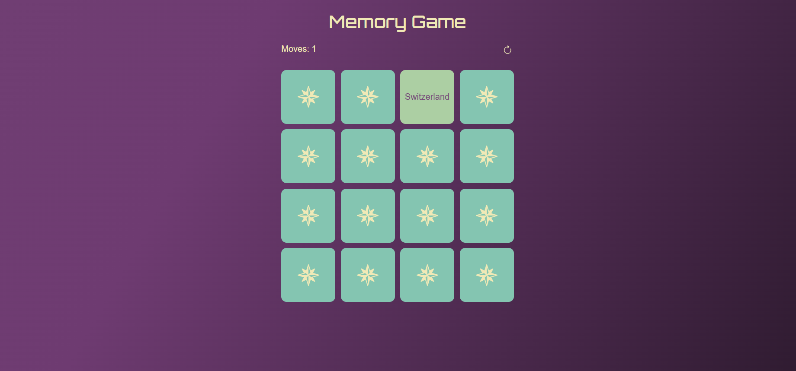

# Memory Game

A simple browser-based memory matching game built with vanilla JavaScript, HTML, and CSS.

Flip cards, find matching pairs, and try to complete the game in as few moves as possible.

## Preview

## Features

- Card matching logic
- Move counter
- Restart functionality
- Smooth card flip animation
- Mismatch feedback animation
- Responsive grid layout

## Tech Stack

- HTML5
- CSS3 (Flexbox, Grid, animations)
- JavaScript

## How to Run

1. Clone the repository:
   git clone https://github.com/kathleen547/memory-game.git

2. Open index.html in your browser

## Project Structure

- index.html – main HTML structure
- styles.css – styling and animations
- script.js – game logic
- capitals.csv – data source
- assets/ – images and icons

## What I Learned

- Managing application state in JavaScript
- Working with DOM events and dynamic elements
- Handling asynchronous operations (fetch, promises)
- Structuring code into reusable functions
- Implementing UI animations with CSS

## Future Improvements

- Add timer
- Add high score system
- Improve mobile responsiveness